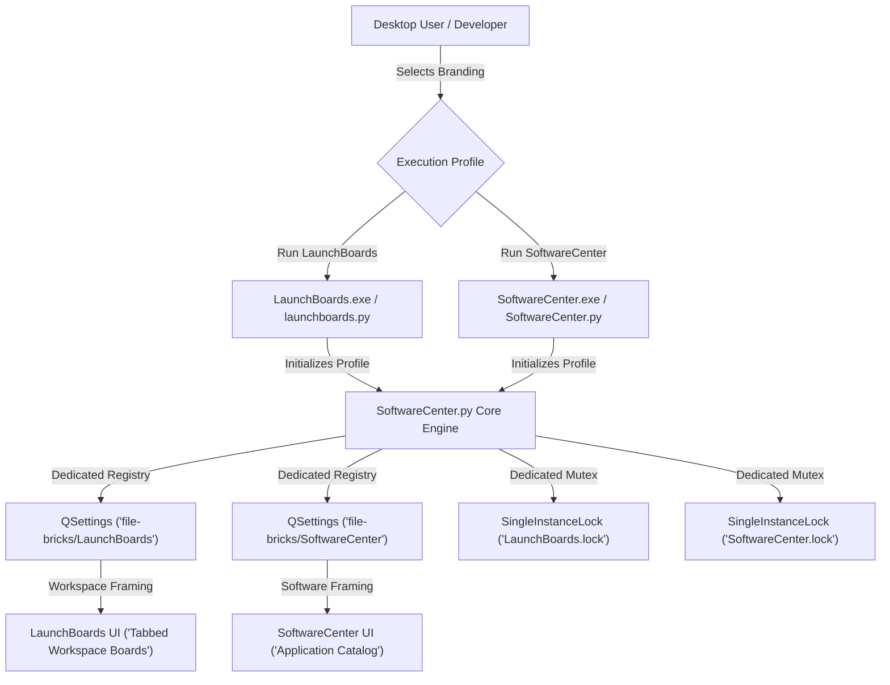
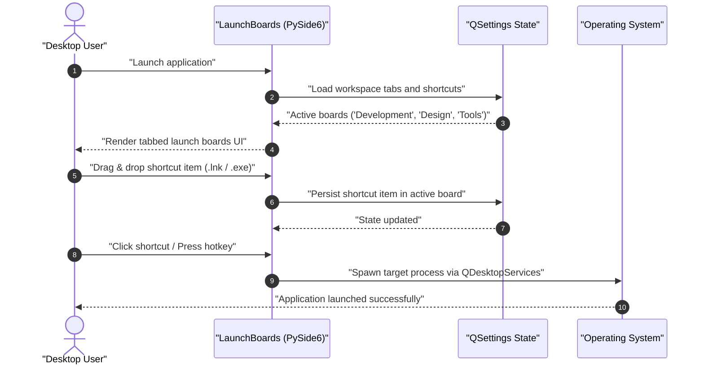

# LaunchBoards

<p align="center">
  <a href="LICENSE"></a>
  <a href="https://github.com/file-bricks/SoftwareCenter/releases"></a>
  <a href="https://github.com/file-bricks/LaunchBoards/actions"></a>
  <a href="https://www.python.org/"></a>
  <a href="https://doc.qt.io/qtforpython-6/"></a>
  <a href="https://www.microsoft.com/windows"></a>
  <a href="THIRD_PARTY_LICENSES.md"></a>
  <a href="THIRD_PARTY_LICENSES.md"></a>
  <a href="https://github.com/file-bricks/LaunchBoards/actions"></a>
  <a href="THIRD_PARTY_LICENSES.md"></a>
  <a href="https://github.com/file-bricks/SoftwareCenter"></a>
  <a href="https://github.com/file-bricks"></a>
  <a href="https://github.com/open-bricks"></a>
  <a href="SECURITY.md"></a>
  <a href="llms.txt"></a>
</p>

---

<p align="center">
  <strong>Organize your app shortcuts into dedicated launch boards and start what you need, when you need it — fast, local-first, and zero telemetry.</strong>
</p>

<p align="center">
  <a href="README.md"><strong>English</strong></a> •
  <a href="README_de.md"><strong>Deutsch</strong></a>
</p>

---

## Quick Navigation

- [What is LaunchBoards?](#what-is-launchboards)
- [Target Personas & Discoverability](#target-personas--discoverability)
- [Why Two Names for One App?](#why-two-names-for-one-app)
- [Architecture & Profile Isolation](#architecture--profile-isolation)
- [Workspace Launch Lifecycle](#workspace-launch-lifecycle)
- [Comparative Matrix vs. Alternatives](#comparative-matrix-vs-alternatives)
- [Core Features](#core-features)
- [Getting Started & How to Run](#getting-started--how-to-run)
- [System Invariants & Governance](#system-invariants--governance)
- [Third-Party Licenses & Transparency](#third-party-licenses--transparency)
- [Canonical Repository & Contributing](#canonical-repository--contributing)
- [Ecosystem & Sister Projects](#ecosystem--sister-projects)
- [Security & Vulnerability Reporting](#security--vulnerability-reporting)
- [License](#license)

---

## What is LaunchBoards?

**LaunchBoards is a specialized second branding of [SoftwareCenter](https://github.com/file-bricks/SoftwareCenter)** — running the identical, battle-tested desktop codebase under a distinct application identity, custom app icon, and separate settings profile (`PROFILE_LAUNCHBOARDS`).

While traditional app launchers focus on browsing a flat directory of installed programs, **LaunchBoards** centers the workflow around **thematic workspaces ("Boards")**. You organize your everyday desktop shortcuts, utilities, IDEs, and project folders into tab-based boards (e.g. *Development*, *Design*, *Daily Office*, *Administration*), switching contexts with a single click.

> [!NOTE]
> LaunchBoards is not a fork or detached clone. It is an officially supported product profile of the canonical [SoftwareCenter](https://github.com/file-bricks/SoftwareCenter) codebase. Both brandings run concurrently without mutual interference.

---

## Target Personas & Discoverability

LaunchBoards is tailored to four concrete user personas seeking a clutter-free, responsive, and privacy-respecting application dashboard:

### [PERSONA-01] Multi-Project Software Engineers & DevOps Practitioners
* **Pain Point:** Desktops overcrowded with dozens of IDE shortcuts, terminal emulators, Docker scripts, and development tools that change based on the active client or project stack.
* **Solution:** Separate boards for distinct projects (e.g., *Frontend Web*, *Kubernetes Ops*, *Rust Embedded*) switchable in under 100 milliseconds with zero background CPU overhead.
* **Key Workflow:** Drag and drop `.lnk` shortcuts, batch scripts, and IDE workspaces into dedicated project tabs; instant filter search to launch target tools without Alt+Tab fatigue.

### [PERSONA-02] Privacy-First Desktop Power Users & Researchers
* **Pain Point:** Frustration with modern OS start menus and cloud-connected launcher SaaS injecting telemetry, online ads, web results, and background update agents.
* **Solution:** 100% offline, zero network egress (`INV-LOCAL-01`), unprivileged user execution (`INV-LOCAL-02`), storing all configuration in native local `QSettings`.
* **Key Workflow:** Completely offline operation on air-gapped workstations or privacy-hardened PCs; portable backup via standard JSON schema (`softwarecenter-profile-v1.json`).

### [PERSONA-03] Creative Directors & Multimedia Producers
* **Pain Point:** Context switching between massive media creation suites (DAWs, 3D suites, NLE video editors, vector tools) with scattered asset directories and plugin helpers.
* **Solution:** Clean tabbed categories (*Audio Production*, *Video Editing*, *3D Rendering*) that keep large application suites neatly segregated.
* **Key Workflow:** Single-click launching of complex media software without heavy Electron launcher overhead consuming valuable system RAM and GPU resources.

### [PERSONA-04] System Administrators & Homelab Operators
* **Pain Point:** Managing dozens of administrative consoles, remote desktop profiles, hypervisor management tools, and SSH batch scripts across multiple environments.
* **Solution:** Centralized, portable launchpad requiring no administrative elevation (UAC-free `RunAsInvoker`), executable directly from a USB stick or network share.
* **Key Workflow:** Deploying a standardized portable `.exe` with a preconfigured `softwarecenter-profile-v1.json` board set for instant workstation administration.

### High-Intent Search & Discovery Keywords
* `local-first desktop workspace organizer`
* `tabbed app launcher Windows`
* `offline software shortcut manager`
* `PySide6 desktop launcher`
* `portable workspace boards Windows 11`
* `zero telemetry application launcher`

---

## Why Two Names for One App?

SoftwareCenter and LaunchBoards represent two complementary conceptual framings of the exact same utility:

| Perspective | Framing | Primary Use Case | Default Profile |
| :--- | :--- | :--- | :--- |
| **SoftwareCenter** | **Software Catalog** | Organizing, categorizing, and launching installed software packages | `PROFILE_SOFTWARECENTER` |
| **LaunchBoards** | **Workspace Boards** | Organizing shortcuts into tabbed launch boards across active projects | `PROFILE_LAUNCHBOARDS` |

Both apps can run side by side on the same machine without colliding:
- Each profile uses its own independent `QSettings` namespace (`file-bricks/LaunchBoards` vs `file-bricks/SoftwareCenter`).
- Each profile uses an independent single-instance lock (`LaunchBoards.lock` vs `SoftwareCenter.lock`), allowing both to run at the same time.
- Both share 100% interoperability with the versioned profile format (`softwarecenter-profile-v1.json`).

---

## Architecture & Profile Isolation

The diagram below illustrates how LaunchBoards leverages the shared core engine while remaining completely isolated in runtime state, configuration, and process mutex locks:



---

## Workspace Launch Lifecycle

LaunchBoards provides a responsive, local-first workflow from startup to process invocation:



---

## Comparative Matrix vs. Alternatives

LaunchBoards is evaluated against four alternative approaches across 10 architectural and governance dimensions:

| Architectural Dimension | Invariant | **LaunchBoards** | Windows Start Menu / Taskbar | PowerToys Run / Flow Launcher | Stardock Fences / Desktop Organizers | Cloud Dashboard SaaS (Notion / Start.me) |
|---|---|---|---|---|---|---|
| **Zero Network Egress** | `INV-LOCAL-01` | **100% Offline (Zero Egress)** | Bing search integration, cloud telemetries | Telemetry / optional web query plugins | License validation ping, updater daemon | Requires constant internet & cloud login |
| **Unprivileged Execution** | `INV-LOCAL-02` | **Strict RunAsInvoker** | OS component (SYSTEM) | Often requires admin elevation for hooks | Shell extension injecting into explorer.exe | Browser sandboxed, data stored remotely |
| **Non-Destructive Deletion** | `INV-LOCAL-03` | **Detaches UI reference only** | May trigger app uninstall | No board structuring | Can inadvertently delete source files | Remote link deletion |
| **Safe Link Resolution** | `INV-LOCAL-04` | **Non-evaluating .lnk parser** | Native shell parsing | Native shell parsing | Native shell parsing | URL hyperlinks only |
| **Profile & Mutex Isolation** | `INV-LOCAL-05`<br>`INV-LOCAL-06` | **Independent QSettings & Mutex** | Single monolithic system state | Single global background instance | Single shell-hooked desktop state | Multi-tenant cloud account |
| **Open Schema Interoperability** | `INV-LOCAL-07` | **Standard JSON profile format** | Proprietary binary database | Custom JSON/XML configs | Proprietary registry layout | Proprietary SaaS export formats |
| **Open Source & Canonical Code**| `INV-LOCAL-08` | **100% Open Source (MIT)** | Proprietary closed-source | Open Source (MIT) | Commercial proprietary | Proprietary SaaS |
| **Bilingual Parity (EN/DE)** | `INV-LOCAL-09` | **100% Reciprocal parity** | OS language dependent | Variable community translations | Variable translations | English first |
| **Security Response SLA** | `INV-LOCAL-10` | **Documented 48h SLA** | Unpredictable OS patch cycle | Best-effort GitHub issues | Commercial helpdesk | Commercial SLA |
| **Zero Installation / Portability** | N/A | **Standalone portable EXE** | Built-in (non-portable) | MSI installer required | Installer + driver hooks required | Web browser dependent |

---

## Core Features

- 📑 **Tabbed Launch Boards:** Create, rename, and rearrange custom workspace boards tailored to specific workflows (e.g. *Code*, *Audio*, *Comms*).
- 🖱️ **Drag & Drop Organization:** Simply drag Windows shortcut files (`.lnk`), executables (`.exe`), scripts, or documents directly into any board.
- ⚡ **Instant Filter Search:** Type to filter shortcuts immediately across all boards without navigating deep menu hierarchies.
- 🔒 **100% Local-First & Zero Telemetry:** No user account, no cloud servers, no telemetry, and zero network traffic.
- 📦 **Portable Profile Migration:** Export and import boards effortlessly using the standard JSON format (`softwarecenter-profile-v1.json`).
- 🔀 **True Side-by-Side Execution:** Run LaunchBoards alongside SoftwareCenter concurrently with dedicated settings and window states.

---

## Getting Started & How to Run

### Option 1: Standalone Windows Executable (Recommended)

Pre-built binaries for LaunchBoards are distributed as standalone, portable Windows executables alongside SoftwareCenter releases:

1. Visit the canonical release page: **[SoftwareCenter Releases](https://github.com/file-bricks/SoftwareCenter/releases)**.
2. Download `LaunchBoards.exe` (or `LaunchBoards-<version>-win64.exe`).
3. Run the executable directly. No installation or administrative privileges required.

### Option 2: Running from Source

Since LaunchBoards shares the canonical codebase, clone and run it via the dedicated runner:

```bash
# Clone the canonical repository
git clone https://github.com/file-bricks/SoftwareCenter.git
cd SoftwareCenter

# Install dependencies (PySide6)
pip install -r requirements.txt

# Launch with the LaunchBoards profile
python launchboards.py
```

### Option 3: Building Standalone Binary Locally

To produce your own portable `LaunchBoards.exe` via PyInstaller, execute the preconfigured build script in the canonical repo:

```cmd
build_exe_launchboards.bat
```

The resulting binary will be located in `dist/LaunchBoards/LaunchBoards.exe` or bundled into root as `LaunchBoards.exe`.

---

## System Invariants & Governance

LaunchBoards adheres to strict operational and architectural invariants:

| ID | Invariant | Description |
| :--- | :--- | :--- |
| `INV-LOCAL-01` | **Zero Network Egress** | No telemetry, phone-home checks, cloud synchronization, or external web requests. |
| `INV-LOCAL-02` | **Unprivileged Run** | Runs strictly in user space (`RunAsInvoker`). Never requests administrative (UAC) elevation. |
| `INV-LOCAL-03` | **Non-Destructive Ops** | Removing a shortcut only detaches the UI reference; target files and executables are never deleted. |
| `INV-LOCAL-04` | **Safe Link Resolution** | Safely extracts target metadata from `.lnk` files without executing shell evaluation scripts. |
| `INV-LOCAL-05` | **Profile Isolation** | QSettings key `file-bricks/LaunchBoards` is strictly isolated from `file-bricks/SoftwareCenter`. |
| `INV-LOCAL-06` | **Mutex Independence** | Single-instance lock `LaunchBoards.lock` permits simultaneous execution with SoftwareCenter. |
| `INV-LOCAL-07` | **Schema Parity** | 100% interoperability with versioned profile schema (`softwarecenter-profile-v1.json`). |
| `INV-LOCAL-08` | **Canonical Authority** | The canonical source of truth for code, tests, and CI is `file-bricks/SoftwareCenter`. |
| `INV-LOCAL-09` | **Bilingual Parity** | All end-user documentation maintains complete German/English alignment (`P-006`). |
| `INV-LOCAL-10` | **Security SLA** | Security disclosures receive a verified response within 48 hours and triage within 5 days. |

---

## Third-Party Licenses & Transparency

LaunchBoards is committed to radical licensing transparency and zero-copyleft contamination for user data:

- **MIT Permissive License:** LaunchBoards itself is licensed under the permissive MIT License.
- **PySide6 / Qt 6 Dynamic Linking:** Compliant with § 4 of the GNU Lesser General Public License (LGPL-3.0). PySide6 is loaded dynamically, allowing end users to upgrade or substitute the underlying Qt runtime without modifying LaunchBoards.
- **Zero-Copyleft Guarantee:** User shortcuts, workspace configurations, and launched binaries remain completely unencumbered by copyleft.
- **SPDX Inventory:** Full dependency breakdown and license texts are documented in [THIRD_PARTY_LICENSES.md](THIRD_PARTY_LICENSES.md).

---

## Canonical Repository & Contributing

This repository (`file-bricks/LaunchBoards`) is maintained as an official branding pointer and entry point for discoverability.

**All active development, issue tracking, and contributions occur in the canonical repository:**

👉 **[github.com/file-bricks/SoftwareCenter](https://github.com/file-bricks/SoftwareCenter)**

- **Issues & Bug Reports:** Please open issues under SoftwareCenter and tag with `[LaunchBoards]`.
- **Pull Requests:** Submit PRs against `file-bricks/SoftwareCenter`.
- **Translations:** Maintained via `manage_translations.py` and `locales/` in the canonical repository.

---

## Ecosystem & Sister Projects

LaunchBoards is part of the **file-bricks** and **open-bricks** desktop tool ecosystem:

| Project | Focus Area | Canonical Repository |
| :--- | :--- | :--- |
| **SoftwareCenter** | Installed software catalog & desktop launcher | [file-bricks/SoftwareCenter](https://github.com/file-bricks/SoftwareCenter) |
| **LaunchBoards** | Tab-based workspace launch boards | [file-bricks/LaunchBoards](https://github.com/file-bricks/LaunchBoards) |
| **TextCrafter** | Local-first distraction-free text editor & Markdown suite | [file-bricks/TextCrafter](https://github.com/file-bricks/TextCrafter) |
| **TagFolder** | Tag-based file navigation and organization tool | [file-bricks/TagFolder](https://github.com/file-bricks/TagFolder) |
| **lock-master** | Deterministic multi-agent file and directory locking | [dev-bricks/lock-master](https://github.com/dev-bricks/lock-master) |
| **open-bricks** | Umbrella registry for open-source desktop applications | [open-bricks/.github](https://github.com/open-bricks) |

---

## Security & Vulnerability Reporting

Security and user privacy are foundational. LaunchBoards executes completely offline and requires no elevated privileges.

If you identify a security issue or vulnerability, please consult our [SECURITY.md](SECURITY.md) policy. We commit to an initial response within **48 hours** and triage within **5 business days**:

- 📧 Security Team: `security@open-bricks.org`
- 📧 Maintainer: `lukas@open-bricks.org`

---

## License

MIT License — see [LICENSE](LICENSE) for full details.

This project is a gratuitous open-source donation. Liability is limited to intent and gross negligence (§ 521 BGB). Use is at your own risk without warranty, maintenance commitment, or guarantee of fitness for a particular purpose.

Copyright (c) 2026 Lukas Geiger.

