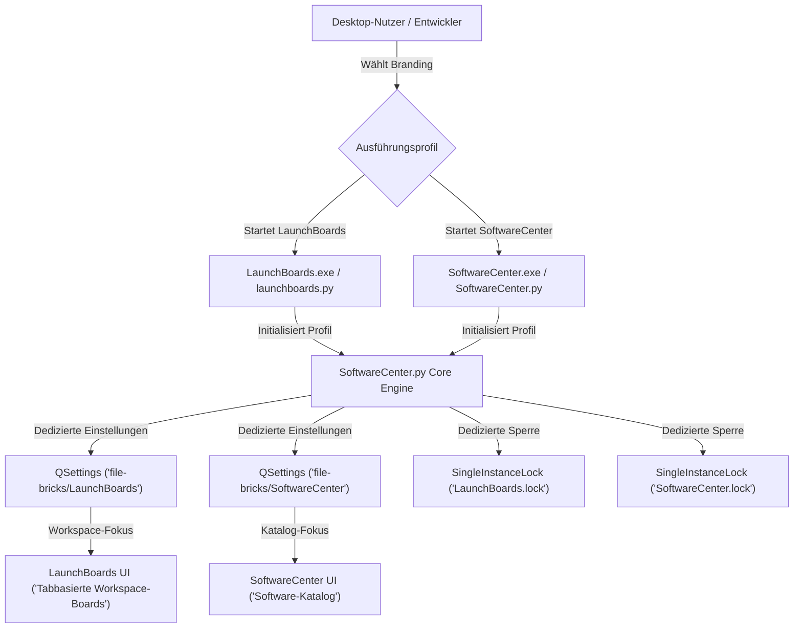
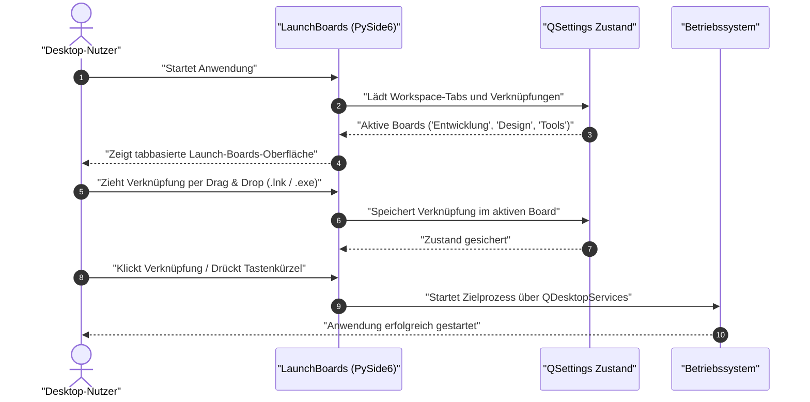

# LaunchBoards

<p align="center">
  <a href="LICENSE"></a>
  <a href="https://github.com/file-bricks/SoftwareCenter/releases"></a>
  <a href="https://github.com/file-bricks/LaunchBoards/actions"></a>
  <a href="https://www.python.org/"></a>
  <a href="https://doc.qt.io/qtforpython-6/"></a>
  <a href="https://www.microsoft.com/windows"></a>
  <a href="THIRD_PARTY_LICENSES.md"></a>
  <a href="THIRD_PARTY_LICENSES.md"></a>
  <a href="https://github.com/file-bricks/LaunchBoards/actions"></a>
  <a href="THIRD_PARTY_LICENSES.md"></a>
  <a href="https://github.com/file-bricks/SoftwareCenter"></a>
  <a href="https://github.com/file-bricks"></a>
  <a href="https://github.com/open-bricks"></a>
  <a href="SECURITY.md"></a>
  <a href="llms.txt"></a>
</p>

---

<p align="center">
  <strong>Organisiere deine App-Verknüpfungen in dedizierten Launch Boards und starte, was du brauchst, wann du es brauchst — schnell, lokal und ohne Telemetrie.</strong>
</p>

<p align="center">
  <a href="README.md"><strong>English</strong></a> •
  <a href="README_de.md"><strong>Deutsch</strong></a>
</p>

---

## Schnellnavigation

- [Was ist LaunchBoards?](#was-ist-launchboards)
- [Zielgruppen & Auffindbarkeit](#zielgruppen--auffindbarkeit)
- [Warum zwei Namen für eine App?](#warum-zwei-namen-für-eine-app)
- [Architektur & Profil-Isolation](#architektur--profil-isolation)
- [Workspace-Lebenszyklus](#workspace-lebenszyklus)
- [Vergleichsmatrix gegenüber Alternativen](#vergleichsmatrix-gegenüber-alternativen)
- [Kernfunktionen](#kernfunktionen)
- [Erste Schritte & Ausführung](#erste-schritte--ausführung)
- [Systeminvarianten & Governance](#systeminvarianten--governance)
- [Drittanbieter-Lizenzen & Transparenz](#drittanbieter-lizenzen--transparenz)
- [Kanonisches Repository & Mitwirken](#kanonisches-repository--mitwirken)
- [Ökosystem & Partnerprojekte](#ökosystem--partnerprojekte)
- [Sicherheit & Schwachstellenmeldung](#sicherheit--schwachstellenmeldung)
- [Lizenz](#lizenz)

---

## Was ist LaunchBoards?

**LaunchBoards ist ein spezialisiertes Zweitbranding von [SoftwareCenter](https://github.com/file-bricks/SoftwareCenter)** — dieselbe praxiserprobte Desktop-Codebasis, gestartet unter einer eigenständigen Anwendungsidentität, eigenem Icon und getrenntem Einstellungsprofil (`PROFILE_LAUNCHBOARDS`).

Während klassische Anwendungsstarter meist auf die lineare Auflistung installierter Programme abzielen, stellt **LaunchBoards** den Workflow rund um **thematische Arbeitsbereiche ("Boards")** in den Mittelpunkt. Du organisierst deine täglichen Verknüpfungen, Entwicklungswerkzeuge, Skripte und Projektordner in tab-basierten Boards (z. B. *Entwicklung*, *Design*, *Büro & Alltag*, *Administration*) und wechselst den Arbeitskontext mit einem Klick.

> [!NOTE]
> LaunchBoards ist kein Fork und kein separater Klon, sondern ein offiziell unterstütztes Produktprofil der kanonischen [SoftwareCenter](https://github.com/file-bricks/SoftwareCenter)-Codebasis. Beide Brandings können parallel ohne gegenseitige Beeinflussung betrieben werden.

---

## Zielgruppen & Auffindbarkeit

LaunchBoards richtet sich an vier konkrete Zielgruppen, die eine aufgeräumte, performante und datenschutzfreundliche Desktop-Schaltzentrale suchen:

### [PERSONA-01] Multi-Projekt-Entwickler & DevOps-Ingenieure
* **Problem:** Unübersichtliche Desktops voller IDE-Verknüpfungen, Terminals, Docker-Startskripte und lokaler Tools, die je nach Stack oder Kunde wechseln.
* **Lösung:** Eigene tabbasierte Boards für jedes Projekt (z. B. *Web-Frontend*, *Kubernetes-Ops*, *Embedded-C*), umschaltbar in unter 100 ms bei null CPU-Hintergrundlast.
* **Kern-Workflow:** Drag & Drop von Verknüpfungen (`.lnk`), Batch-Skripten und Workspace-Dateien in dedizierte Projekt-Tabs; blitzschnelle Filtersuche ohne Alt+Tab-Reizüberflutung.

### [PERSONA-02] Datenschutzbewusste Power-User & Forscher
* **Problem:** Frust über moderne OS-Startmenüs und Cloud-Starter, die Telemetriedaten senden, Web-Ergebnisse einblenden und Hintergrunddienste erzwingen.
* **Lösung:** 100 % offline, kein Netzwerkverkehr (`INV-LOCAL-01`), unprivilegierte Nutzerausführung (`INV-LOCAL-02`), Speicherung rein lokal in `QSettings`.
* **Kern-Workflow:** Vollständig autarker Betrieb auf Offline-Rechnern; portable Sicherung über standardisiertes JSON-Schema (`softwarecenter-profile-v1.json`).

### [PERSONA-03] Mediengestalter & Kreativschaffende
* **Problem:** Ständiger Kontextwechsel zwischen umfangreichen Multimedia-Suiten (DAWs, Videoschnitt, 3D-Tools, Bildbearbeitung) mit verstreuten Asset-Ordnern.
* **Lösung:** Klare thematische Kategorien (*Audioproduktion*, *Videoschnitt*, *3D-Rendering*), die schwere Softwarepakete sauber trennen.
* **Kern-Workflow:** 1-Klick-Start ressourcenintensiver Kreativsoftware ohne speicherhungrige Electron-Launcher im Hintergrund.

### [PERSONA-04] Systemadministratoren & Homelab-Betreiber
* **Problem:** Verwaltung zahlloser Verwaltungskonsolen, Remote-Desktop-Profile, Hypervisor-Tools und SSH-Skripte über verschiedene Umgebungen hinweg.
* **Lösung:** Zentraler, portabler Starter ohne Installations- oder Admin-Rechte (`RunAsInvoker`), direkt von USB-Sticks oder Netzlaufwerken ausführbar.
* **Kern-Workflow:** Bereitstellung einer portablen `.exe` mit vordefiniertem `softwarecenter-profile-v1.json` für die standardisierte Rechnerwartung.

### Relevante Suchbegriffe & Auffindbarkeit
* `lokaler Desktop Workspace Manager`
* `tabbasierter Anwendungsstarter Windows`
* `offline Programmverknüpfungen verwalten`
* `PySide6 Starter ohne Telemetrie`
* `portable Arbeitsbereich Boards Windows 11`
* `datenschutzfreundlicher Desktop Launcher`

---

## Warum zwei Namen für eine App?

SoftwareCenter und LaunchBoards betonen zwei komplementäre Blickwinkel auf dasselbe Werkzeug:

| Perspektive | Schwerpunkt | Primärer Einsatzzweck | Standard-Profil |
| :--- | :--- | :--- | :--- |
| **SoftwareCenter** | **Software-Katalog** | Organisieren, Kategorisieren und Starten installierter Anwendungspakete | `PROFILE_SOFTWARECENTER` |
| **LaunchBoards** | **Workspace-Boards** | Organisieren von Verknüpfungen in tabbasierte Boards für laufende Projekte | `PROFILE_LAUNCHBOARDS` |

Beide Anwendungen können parallel auf demselben System betrieben werden:
- Jedes Profil nutzt einen eigenen `QSettings`-Namespace (`file-bricks/LaunchBoards` vs. `file-bricks/SoftwareCenter`).
- Jedes Profil nutzt eine separate Single-Instance-Sperre (`LaunchBoards.lock` vs. `SoftwareCenter.lock`), wodurch beide Programme gleichzeitig laufen können.
- Beide unterstützen den standardisierten Profil-Export (`softwarecenter-profile-v1.json`) mit voller Interoperabilität.

---

## Architektur & Profil-Isolation

Das folgende Diagramm visualisiert, wie LaunchBoards auf der gemeinsamen Kern-Engine aufsetzt, während Konfiguration, Single-Instance-Mutex und Nutzeroberfläche vollständig isoliert bleiben:



---

## Workspace-Lebenszyklus

LaunchBoards bietet einen reaktionsschnellen, rein lokalen Ablauf vom Start bis zum Anwendungsaufruf:



---

## Vergleichsmatrix gegenüber Alternativen

LaunchBoards im direkten Vergleich mit vier alternativen Ansätzen über 10 Architektur- und Governance-Dimensionen:

| Technische Dimension | Invariante | **LaunchBoards** | Windows Startmenü / Taskleiste | PowerToys Run / Flow Launcher | Stardock Fences / Desktop-Tools | Cloud Dashboard SaaS (Notion / Start.me) |
|---|---|---|---|---|---|---|
| **Zero Network Egress** | `INV-LOCAL-01` | **100 % offline (Zero Egress)** | Bing-Suche, Cloud-Telemetrie | Telemetrie / optionale Web-Plugins | Lizenzprüfungs-Pings, Updater | Dauerhafte Internet- & Cloud-Pflicht |
| **Unprivilegierte Ausführung** | `INV-LOCAL-02` | **Strikter RunAsInvoker-Modus** | OS-Kernkomponente (SYSTEM) | Häufig Admin-Rechte für Hooks nötig | Explorer.exe Shell-Injection | Browser-Sandbox, Remote-Speicherung |
| **Zerstörungsfreie Aktionen** | `INV-LOCAL-03` | **Löscht nur UI-Referenz** | Kann Software-Deinstallation starten | Keine Tab-Strukturierung | Kann versehentlich Originaldateien löschen | Reine URL-Verwaltung |
| **Sichere Link-Auflösung** | `INV-LOCAL-04` | **Reine Metadaten-Extraktion** | Native Shell-Auswertung | Native Shell-Auswertung | Native Shell-Auswertung | Reine Hyperlinks |
| **Profil- & Mutex-Isolation** | `INV-LOCAL-05`<br>`INV-LOCAL-06` | **Eigene QSettings & Mutex-Sperre** | Monolithischer Windows-Zustand | Einzelne globale Instanz | Shell-gebundener Desktop-Zustand | Multi-Tenant Cloud-Konto |
| **Offenes Standard-Schema** | `INV-LOCAL-07` | **Standardisiertes JSON-Format** | Proprietäre Binärdatenbank | Eigene JSON/XML-Formate | Proprietäre Registry-Struktur | Proprietärer SaaS-Export |
| **Open Source & Code-Kanonik** | `INV-LOCAL-08` | **100 % Open Source (MIT)** | Proprietär / Closed Source | Open Source (MIT) | Proprietäre Kaufsoftware | Proprietäre SaaS |
| **Zweisprachige Parität (EN/DE)** | `INV-LOCAL-09` | **100 % wechselseitige Parität** | Systemabhängig | Variable Community-Übersetzung | Variable Übersetzung | Meist rein englisch |
| **Sicherheits-Reaktions-SLA** | `INV-LOCAL-10` | **Dokumentiertes 48h-SLA** | Unberechenbare OS-Patchzyklen | Best-effort GitHub Issues | Kommerzieller Support | Kommerzieller Support |
| **Portabilität ohne Installation** | N/A | **Standalone Portable EXE** | Fest integriert (nicht portabel) | MSI-Installer erforderlich | Installer + Treiber-Hooks nötig | Browser-Abhängigkeit |

---

## Kernfunktionen

- 📑 **Tabbasierte Launch Boards:** Erstelle, benenne und sortiere Arbeitsbereich-Boards nach deinen Bedürfnissen (z. B. *Code*, *Audio*, *Kommunikation*).
- 🖱️ **Drag & Drop Organisation:** Ziehe Windows-Verknüpfungen (`.lnk`), Programme (`.exe`), Skripte oder Dokumente direkt in jedes Board.
- ⚡ **Sofortige Filtersuche:** Tippe los, um Verknüpfungen über alle Boards hinweg sofort zu filtern — ohne verschachtelte Menüs.
- 🔒 **100 % lokal & ohne Telemetrie:** Kein Benutzerkonto, keine Cloud-Server, keine Telemetriedaten und kein Netzwerkverkehr.
- 📦 **Portable Profile:** Exportiere und importiere deine Boards einfach im standardisierten JSON-Format (`softwarecenter-profile-v1.json`).
- 🔀 **Echte parallele Nutzung:** Betreibe LaunchBoards und SoftwareCenter gleichzeitig mit getrennten Einstellungen und Fensterzuständen.

---

## Erste Schritte & Ausführung

### Option 1: Standalone Windows Executable (Empfohlen)

Vorkompilierte Binärdateien für LaunchBoards werden als eigenständige, portable Windows-Executables zusammen mit den SoftwareCenter-Releases bereitgestellt:

1. Besuche die offizielle Release-Seite: **[SoftwareCenter Releases](https://github.com/file-bricks/SoftwareCenter/releases)**.
2. Lade `LaunchBoards.exe` (oder `LaunchBoards-<version>-win64.exe`) herunter.
3. Starte die Datei direkt — keine Installation und keine Administratorrechte erforderlich.

### Option 2: Start aus dem Quelltext

Da LaunchBoards auf der gemeinsamen Codebasis basiert, kannst du das Repository klonen und den Runner starten:

```bash
# Kanonisches Repository klonen
git clone https://github.com/file-bricks/SoftwareCenter.git
cd SoftwareCenter

# Abhängigkeiten installieren (PySide6)
pip install -r requirements.txt

# Mit dem LaunchBoards-Profil starten
python launchboards.py
```

### Option 3: Eigenständige EXE lokal bauen

Um deine eigene portable `LaunchBoards.exe` via PyInstaller zu erzeugen, führe das Build-Skript im kanonischen Repository aus:

```cmd
build_exe_launchboards.bat
```

Die fertige Datei befindet sich anschließend unter `dist/LaunchBoards/LaunchBoards.exe` bzw. im Projekt-Root.

---

## Systeminvarianten & Governance

LaunchBoards unterliegt 10 strikten operativen und architektonischen Invarianten:

| ID | Invariante | Beschreibung |
| :--- | :--- | :--- |
| `INV-LOCAL-01` | **Zero Network Egress** | Keine Telemetrie, keine Phone-Home-Prüfungen, keine Cloud-Synchronisation und keine externen Webanfragen. |
| `INV-LOCAL-02` | **Unprivileged Run** | Läuft strikt im Benutzerkontext (`RunAsInvoker`). Fordert niemals Administratorrechte (UAC) an. |
| `INV-LOCAL-03` | **Non-Destructive Ops** | Das Entfernen einer Verknüpfung löscht nur die UI-Referenz; Originaldateien und Programme bleiben unberührt. |
| `INV-LOCAL-04` | **Safe Link Resolution** | Liest Zielpfade aus `.lnk`-Dateien sicher aus, ohne Shell-Skripte auszuführen. |
| `INV-LOCAL-05` | **Profile Isolation** | Der QSettings-Schlüssel `file-bricks/LaunchBoards` ist strikt von `file-bricks/SoftwareCenter` getrennt. |
| `INV-LOCAL-06` | **Mutex Independence** | Eigene Single-Instance-Sperre `LaunchBoards.lock` erlaubt simultanen Betrieb mit SoftwareCenter. |
| `INV-LOCAL-07` | **Schema Parity** | 100 % Kompatibilität mit dem versionierten Profil-Schema (`softwarecenter-profile-v1.json`). |
| `INV-LOCAL-08` | **Canonical Authority** | Die kanonische Source of Truth für Code, Tests und CI ist `file-bricks/SoftwareCenter`. |
| `INV-LOCAL-09` | **Bilingual Parity** | Alle Endnutzer-Dokumente halten vollständige Deutsch/Englisch-Parität ein (`P-006`). |
| `INV-LOCAL-10` | **Security SLA** | Sicherheitsmeldungen erhalten eine verifizierte Antwort binnen 48 Stunden und Triage binnen 5 Tagen. |

---

## Drittanbieter-Lizenzen & Transparenz

LaunchBoards verpflichtet sich zu lückenloser Lizenztransparenz und dem Schutz von Nutzerdaten vor Copyleft-Effekten:

- **Freie MIT-Lizenz:** LaunchBoards selbst steht unter der liberalen MIT-Lizenz.
- **Dynamische PySide6 / Qt 6 Verknüpfung:** Konform mit § 4 der GNU Lesser General Public License (LGPL-3.0). PySide6 wird dynamisch geladen, sodass Nutzer die Qt-Bibliotheken selbst austauschen können.
- **Zero-Copyleft-Garantie:** Verknüpfungen, Profildateien und gestartete Anwendungen der Nutzer bleiben vollständig frei von Copyleft-Pflichten.
- **SPDX-Inventar:** Detaillierte Abhängigkeitslisten und Lizenztexte sind in [THIRD_PARTY_LICENSES.md](THIRD_PARTY_LICENSES.md) dokumentiert.

---

## Kanonisches Repository & Mitwirken

Dieses Repository (`file-bricks/LaunchBoards`) dient als offizieller Branding-Einstiegspunkt für Auffindbarkeit und Dokumentation.

**Die aktive Weiterentwicklung, Issue-Verfolgung und Pull Requests finden im Haupt-Repository statt:**

👉 **[github.com/file-bricks/SoftwareCenter](https://github.com/file-bricks/SoftwareCenter)**

- **Issues & Fehlermeldungen:** Bitte unter SoftwareCenter eröffnen und mit `[LaunchBoards]` kennzeichnen.
- **Pull Requests:** Werden gegen `file-bricks/SoftwareCenter` eingereicht.
- **Übersetzungen:** Werden über `manage_translations.py` und `locales/` im Haupt-Repository gepflegt.

---

## Ökosystem & Partnerprojekte

LaunchBoards ist Teil des **file-bricks** und **open-bricks** Desktop-Ökosystems:

| Projekt | Schwerpunkt | Kanonisches Repository |
| :--- | :--- | :--- |
| **SoftwareCenter** | Katalog für installierte Software & Desktop-Launcher | [file-bricks/SoftwareCenter](https://github.com/file-bricks/SoftwareCenter) |
| **LaunchBoards** | Tabbasierte Arbeitsbereich-Boards für Verknüpfungen | [file-bricks/LaunchBoards](https://github.com/file-bricks/LaunchBoards) |
| **TextCrafter** | Lokaler, ablenkungsfreier Markdown- und Texteditor | [file-bricks/TextCrafter](https://github.com/file-bricks/TextCrafter) |
| **TagFolder** | Tag-basierte Dateiverwaltung und Organisation | [file-bricks/TagFolder](https://github.com/file-bricks/TagFolder) |
| **lock-master** | Deterministisches Multi-Agenten Datei- und Ordner-Locking | [dev-bricks/lock-master](https://github.com/dev-bricks/lock-master) |
| **open-bricks** | Dachorganisation für quelloffene Desktop-Anwendungen | [open-bricks/.github](https://github.com/open-bricks) |

---

## Sicherheit & Schwachstellenmeldung

Sicherheit und Privatsphäre stehen an erster Stelle. LaunchBoards läuft vollständig offline und benötigt keine erhöhten Benutzerrechte.

Wenn du eine Schwachstelle oder ein Sicherheitsproblem findest, befolge bitte unsere [SECURITY.md](SECURITY.md)-Richtlinie. Wir garantieren eine Rückmeldung binnen **48 Stunden** und Triage binnen **5 Werktagen**:

- 📧 Security Team: `security@open-bricks.org`
- 📧 Maintainer: `lukas@open-bricks.org`

---

## Lizenz

MIT-Lizenz — siehe [LICENSE](LICENSE) für den vollständigen Text.

Dieses Projekt ist eine unentgeltliche Open-Source-Spende. Die Haftung ist auf Vorsatz und grobe Fahrlässigkeit beschränkt (§ 521 BGB). Nutzung auf eigenes Risiko. Es gibt keine Garantie, Wartungszusage oder Zusicherung einer bestimmten Eignung.

Copyright (c) 2026 Lukas Geiger.

