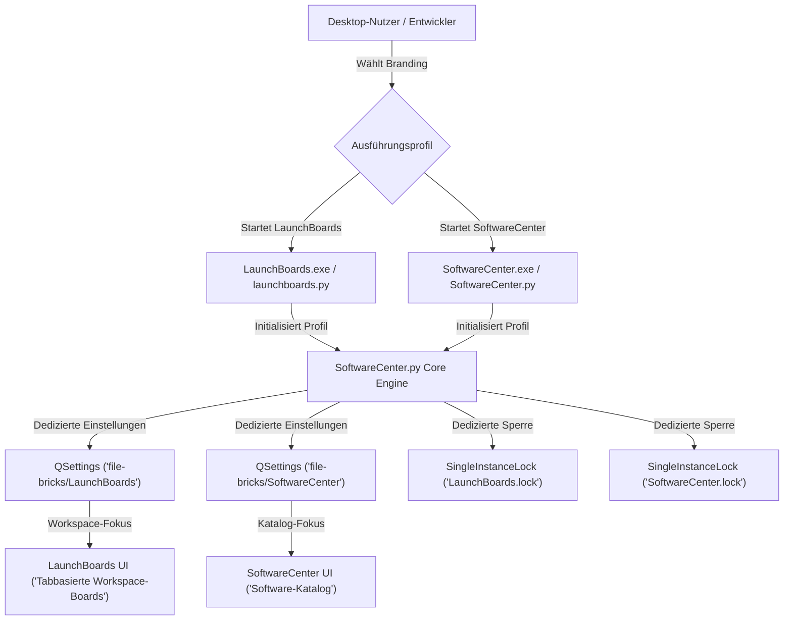

# LaunchBoards

<p align="center">
  <a href="LICENSE"></a>
  <a href="https://github.com/file-bricks/SoftwareCenter/releases"></a>
  <a href="https://www.python.org/"></a>
  <a href="https://doc.qt.io/qtforpython-6/"></a>
  <a href="https://www.microsoft.com/windows"></a>
  <a href="https://github.com/file-bricks/SoftwareCenter"></a>
  <a href="https://github.com/file-bricks"></a>
  <a href="https://github.com/open-bricks"></a>
  <a href="SECURITY.md"></a>
  <a href="llms.txt"></a>
</p>

---

<p align="center">
  <strong>Organisiere deine App-Verknüpfungen in dedizierten Launch Boards und starte, was du brauchst, wann du es brauchst — schnell, lokal und ohne Telemetrie.</strong>
</p>

<p align="center">
  <a href="README.md"><strong>English</strong></a> •
  <a href="README_de.md"><strong>Deutsch</strong></a>
</p>

---

## Schnellnavigation

- [Was ist LaunchBoards?](#was-ist-launchboards)
- [Warum zwei Namen für eine App?](#warum-zwei-namen-für-eine-app)
- [Architektur & Profil-Isolation](#architektur--profil-isolation)
- [Workspace-Lebenszyklus](#workspace-lebenszyklus)
- [Kernfunktionen](#kernfunktionen)
- [Erste Schritte & Ausführung](#erste-schritte--ausführung)
- [Systeminvarianten & Governance](#systeminvarianten--governance)
- [Kanonisches Repository & Mitwirken](#kanonisches-repository--mitwirken)
- [Ökosystem & Partnerprojekte](#ökosystem--partnerprojekte)
- [Sicherheit & Schwachstellenmeldung](#sicherheit--schwachstellenmeldung)
- [Lizenz](#lizenz)

---

## Was ist LaunchBoards?

**LaunchBoards ist ein spezialisiertes Zweitbranding von [SoftwareCenter](https://github.com/file-bricks/SoftwareCenter)** — dieselbe praxiserprobte Desktop-Codebasis, gestartet unter einer eigenständigen Anwendungsidentität, eigenem Icon und getrenntem Einstellungsprofil (`PROFILE_LAUNCHBOARDS`).

Während klassische Anwendungsstarter meist auf die lineare Auflistung installierter Programme abzielen, stellt **LaunchBoards** den Workflow rund um **thematische Arbeitsbereiche ("Boards")** in den Mittelpunkt. Du organisierst deine täglichen Verknüpfungen, Entwicklungswerkzeuge, Skripte und Projektordner in tab-basierten Boards (z. B. *Entwicklung*, *Design*, *Büro & Alltag*, *Administration*) und wechselst den Arbeitskontext mit einem Klick.

> [!NOTE]
> LaunchBoards ist kein Fork und kein separater Klon, sondern ein offiziell unterstütztes Produktprofil der kanonischen [SoftwareCenter](https://github.com/file-bricks/SoftwareCenter)-Codebasis. Beide Brandings können parallel ohne gegenseitige Beeinflussung betrieben werden.

---

## Warum zwei Namen für eine App?

SoftwareCenter und LaunchBoards betonen zwei komplementäre Blickwinkel auf dasselbe Werkzeug:

| Perspektive | Schwerpunkt | Primärer Einsatzzweck | Standard-Profil |
| :--- | :--- | :--- | :--- |
| **SoftwareCenter** | **Software-Katalog** | Organisieren, Kategorisieren und Starten installierter Anwendungspakete | `PROFILE_SOFTWARECENTER` |
| **LaunchBoards** | **Workspace-Boards** | Organisieren von Verknüpfungen in tabbasierte Boards für laufende Projekte | `PROFILE_LAUNCHBOARDS` |

Beide Anwendungen können parallel auf demselben System betrieben werden:
- Jedes Profil nutzt einen eigenen `QSettings`-Namespace (`file-bricks/LaunchBoards` vs. `file-bricks/SoftwareCenter`).
- Jedes Profil nutzt eine separate Single-Instance-Sperre (`LaunchBoards.lock` vs. `SoftwareCenter.lock`), wodurch beide Programme gleichzeitig laufen können.
- Beide unterstützen den standardisierten Profil-Export (`softwarecenter-profile-v1.json`) mit voller Interoperabilität.

---

## Architektur & Profil-Isolation

Das folgende Diagramm visualisiert, wie LaunchBoards auf der gemeinsamen Kern-Engine aufsetzt, während Konfiguration, Single-Instance-Mutex und Nutzeroberfläche vollständig isoliert bleiben:



---

## Workspace-Lebenszyklus

LaunchBoards bietet einen reaktionsschnellen, rein lokalen Ablauf vom Start bis zum Anwendungsaufruf:


---

## Kernfunktionen

- 📑 **Tabbasierte Launch Boards:** Erstelle, benenne und sortiere individuelle Arbeitsbereich-Tabs nach Projekt oder Kontext (z. B. *Code*, *Audio*, *Administration*).
- 🖱️ **Drag & Drop Organisation:** Ziehe Windows-Verknüpfungen (`.lnk`), Programme (`.exe`), Skripte oder Ordner direkt auf ein beliebiges Board.
- ⚡ **Echtzeit-Suchfilter:** Tippe sofort los, um Verknüpfungen boardübergreifend in Millisekunden zu filtern, ohne tiefe Menüs zu durchsuchen.
- 🔒 **100% Lokal & Null Telemetrie:** Kein Benutzerkonto, keine Cloud-Server, kein Tracking und null ausgehender Netzwerkverkehr.
- 📦 **Portabler Profil-Export:** Sichere und übertrage deine Boards im standardisierten JSON-Format (`softwarecenter-profile-v1.json`).
- 🔀 **Parallele Nutzung:** Betreibe LaunchBoards und SoftwareCenter gleichzeitig mit jeweils eigenen Fenster- und Tab-Zuständen.

---

## Erste Schritte & Ausführung

### Option 1: Standalone Windows Executable (Empfohlen)

Vorkompilierte Binärdateien für LaunchBoards werden als eigenständige, portable Windows-Executables über die Releases von SoftwareCenter bereitgestellt:

1. Besuche die kanonische Release-Seite: **[SoftwareCenter Releases](https://github.com/file-bricks/SoftwareCenter/releases)**.
2. Lade `LaunchBoards.exe` (oder `LaunchBoards-<version>-win64.exe`) herunter.
3. Starte die EXE direkt. Keine Installation oder Administratorrechte erforderlich.

### Option 2: Start aus dem Quellcode

Da LaunchBoards die Codebasis mit SoftwareCenter teilt, klone das Haupt-Repository und starte über das dedizierte Startskript:

```bash
# Kanonisches Repository klonen
git clone https://github.com/file-bricks/SoftwareCenter.git
cd SoftwareCenter

# Abhängigkeiten installieren (PySide6)
pip install -r requirements.txt

# LaunchBoards-Profil starten
python launchboards.py
```

### Option 3: Eigenständige EXE lokal bauen

Um eine eigene portable `LaunchBoards.exe` via PyInstaller zu erzeugen, führe im kanonischen Repo das vorkonfigurierte Skript aus:

```cmd
build_exe_launchboards.bat
```

Die fertige Datei liegt anschließend in `dist/LaunchBoards/LaunchBoards.exe` bzw. im Stammverzeichnis als `LaunchBoards.exe`.

---

## Systeminvarianten & Governance

LaunchBoards unterliegt festen Architektur- und Betriebsinvarianten:

| ID | Invariante | Beschreibung |
| :--- | :--- | :--- |
| `INV-LOCAL-01` | **Null Netzwerkverkehr** | Keine Telemetrie, keine Update-Pings, keine Cloud-Syncs oder externe Webaufrufe. |
| `INV-LOCAL-02` | **Rechtefreier Betrieb** | Läuft strikt im Standard-Nutzerkontext (`RunAsInvoker`). Fordert niemals UAC-Rechte an. |
| `INV-LOCAL-03` | **Zerstörungsfreie Aktionen** | Das Entfernen einer Verknüpfung löscht nur den UI-Verweis; Zieldateien bleiben unangetastet. |
| `INV-LOCAL-04` | **Sichere Link-Auflösung** | Liest Metadaten aus `.lnk`-Dateien sicher aus, ohne Shell-Skripte auszuführen. |
| `INV-LOCAL-05` | **Profil-Isolation** | QSettings-Schlüssel `file-bricks/LaunchBoards` ist strikt von `file-bricks/SoftwareCenter` getrennt. |
| `INV-LOCAL-06` | **Mutex-Unabhängigkeit** | Eigene Sperre `LaunchBoards.lock` erlaubt die gleichzeitige Ausführung beider Apps. |
| `INV-LOCAL-07` | **Schema-Parität** | 100%ige Kompatibilität mit dem Profilformat `softwarecenter-profile-v1.json`. |
| `INV-LOCAL-08` | **Kanonische Autorität** | Maßgebliche Quelle für Code, Tests und CI ist ausschließlich `file-bricks/SoftwareCenter`. |
| `INV-LOCAL-09` | **Zweisprachige Parität** | Alle Endnutzerdokumente werden in deutscher und englischer Sprache synchron gehalten (`P-006`). |
| `INV-LOCAL-10` | **Sicherheits-SLA** | Meldungen erhalten eine Erstantwort binnen 48 Stunden und Triage binnen 5 Werktagen. |

---

## Kanonisches Repository & Mitwirken

Dieses Repository (`file-bricks/LaunchBoards`) dient als offizieller Einstiegspunkt und Zweitbranding für die Auffindbarkeit.

**Die gesamte Entwicklung, Issue-Verwaltung und Code-Beiträge finden im kanonischen Repository statt:**

👉 **[github.com/file-bricks/SoftwareCenter](https://github.com/file-bricks/SoftwareCenter)**

- **Issues & Fehlermeldungen:** Bitte in SoftwareCenter mit dem Präfix `[LaunchBoards]` eröffnen.
- **Pull Requests:** Bitte gegen `file-bricks/SoftwareCenter` einreichen.
- **Übersetzungen:** Werden über `manage_translations.py` und `locales/` im Haupt-Repo gepflegt.

---

## Ökosystem & Partnerprojekte

LaunchBoards ist Teil des **file-bricks**- und **open-bricks**-Desktop-Ökosystems:

| Projekt | Schwerpunkt | Kanonisches Repository |
| :--- | :--- | :--- |
| **SoftwareCenter** | Katalog installierter Software & Programmstarter | [file-bricks/SoftwareCenter](https://github.com/file-bricks/SoftwareCenter) |
| **LaunchBoards** | Tabbasierte Workspace-Launch-Boards | [file-bricks/LaunchBoards](https://github.com/file-bricks/LaunchBoards) |
| **TextCrafter** | Ablenkungsfreier lokaler Text- & Markdown-Editor | [file-bricks/TextCrafter](https://github.com/file-bricks/TextCrafter) |
| **TagFolder** | Tag-basierte Dateiorganisation und -navigation | [file-bricks/TagFolder](https://github.com/file-bricks/TagFolder) |
| **lock-master** | Deterministisches Multi-Agenten Datei- und Ordner-Locking | [dev-bricks/lock-master](https://github.com/dev-bricks/lock-master) |
| **open-bricks** | Dachorganisation für Open-Source Desktop-Anwendungen | [open-bricks/.github](https://github.com/open-bricks) |

---

## Sicherheit & Schwachstellenmeldung

Sicherheit und Datenschutz stehen an erster Stelle. LaunchBoards arbeitet vollständig offline und benötigt keinerlei Administratorrechte.

Solltest du ein Sicherheitsproblem finden, beachte bitte unsere Richtlinie in [SECURITY.md](SECURITY.md). Wir garantieren eine Rückmeldung innerhalb von **48 Stunden** und eine Triage binnen **5 Werktagen**:

- 📧 Sicherheits-Team: `security@open-bricks.org`
- 📧 Maintainer: `lukas@open-bricks.org`

---

## Lizenz

MIT-Lizenz — siehe [LICENSE](LICENSE) für Details.

Copyright (c) 2026 Lukas Geiger.
